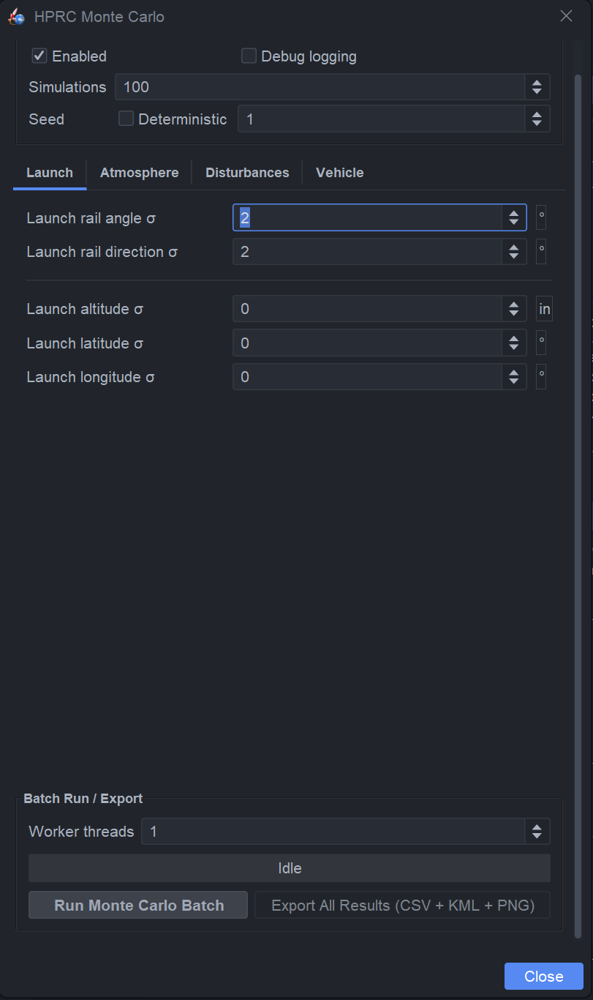
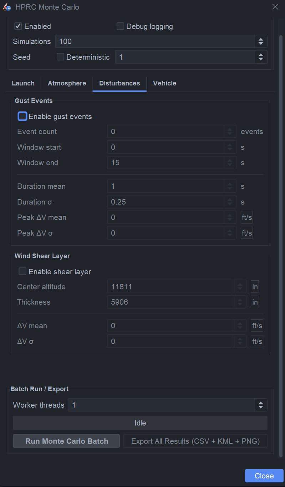
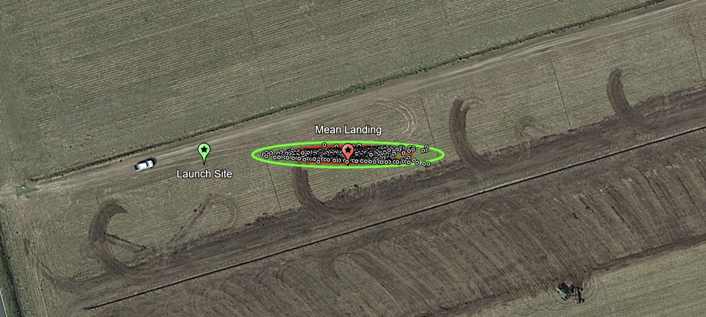

# OpenRocket Monte Carlo + 6DOF Landing Dispersion

A plugin utilizing underlying logic from Watarloo Rocketry and TU Wien Space Team to directly employ Monte Carlo Simulations and 6DOF Landing Dispersion anyalsis. The current logic is overhauled to account for basic parameters up until wind gust events, shear layers, vehicle & motor performance, as well as base Cd. 

    
    

Furthermore, the 6DOF Landing Dispersion was translated from Python to Java code to interface with current the current OpenRocket Version. It features a launch site, mean landing site, and individual landing markers along with 1, 2, and 3 sigma confidence ellipses all exported in a .kml file for Google Earth viewing. 

All results are exported in .csv files for further data processing for MATLAB or Pandas usage for visulaization and modifying. 

# Usage

Simply download the latest .jar file from the releases tab and insert into the directory 'C:\Users\[user]\AppData\Roaming\OpenRocket\Plugins'

# Credits
Waterloo Monte Carlo Link: https://github.com/waterloo-rocketry/or-monte-carlo 
TU Wien Space Team 6DOF Link: https://github.com/SpaceTeam/ortools 